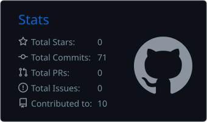
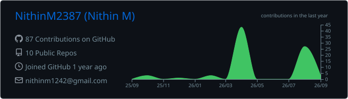
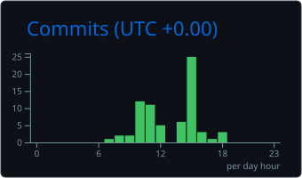
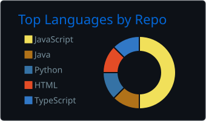
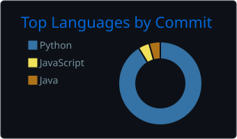

<h1 align="center">Hi 👋, I'm Nithin M</h1>

  <strong>Full-Stack Developer • MERN Stack • Backend &amp; API Development</strong>

  I build practical, scalable web applications and backend systems with a focus on clean architecture, APIs, databases, and deployment.

  
  
  

---

## 👨‍💻 About Me

I'm Nithin M, an Information Science & Engineering student at **RV Institute of Technology and Management** and a **full-stack developer** who enjoys turning ideas into practical, production-ready applications.

- 💻 Building full-stack applications with **MERN, REST APIs, and backend systems**
- 🧩 Interested in **API security, databases, system design, and scalable architectures**
- ☁️ Exploring **Docker, CI/CD, AWS, Cloud, and DevOps**
- 🛠️ I learn by **building, deploying, debugging, and improving real-world projects**
- 🧠 Currently strengthening my **DSA, problem-solving, and backend architecture skills**
- 🚀 My goal is to grow into a **software engineer capable of taking products from idea to deployment**

## Tech Stack

### Languages

  

### Frontend

  

### Backend &amp; Databases

  

### DevOps &amp; Cloud

  

### Tools

  

---

## 🚀 Featured Projects

### 🛒 Grocery Delivery Platform

Full-stack grocery delivery platform with authentication, product management, cart, orders, payments, and admin functionality.

🌐 **Live Demo:** [Grocery Delivery Platform](grocery-delivery-nithin.vercel.app)

**Tech:** React · Node.js · Express.js · MongoDB · JWT · REST API

---

### 🤖 AI Website Builder

AI-powered website builder project.

🌐 **Live Demo:** [AI Website Builder](https://ai-website-builder-ai.vercel.app/)

**Tech:** React · Node.js · Express.js · MongoDB · JWT · REST API

---

### 🔐 Secure E-Commerce REST API

Production-oriented backend API covering authentication, user management, product/category management, cart, wishlist, orders, payments, invoices, and administration.

🌐 **Live API:** [Secure E-Commerce REST API](https://secure-ecommerce-backend-kfy3.onrender.com/api-docs)

**Tech:** Node.js · Express.js · MongoDB · JWT · Redis · BullMQ · Stripe · Cloudinary · Docker · Swagger · Jest · Render

---

### 🍽️ Restaurant Management Platform

A full-stack restaurant platform focused on managing restaurant operations, menus, orders, users, and related workflows through a secure web application.

🌐 **Live Demo:** [Restaurant Management Platform](https://quickdine-restaurant-booking.vercel.app/)

**Tech:** React · Node.js · Express.js · MongoDB · JWT · REST API

---

## GitHub Analytics

### GitHub Statistics

  

### Contribution Activity

  

### GitHub Overview

  

### Top Languages

  
  

---

## Currently Learning

  DSA • System Design • Docker • CI/CD • AWS • Backend Architecture • API Security

## My Development Focus

<table>
  <tr>
    <td align="center" width="25%">
      <strong>💻 Development</strong>  
      Full-Stack 
      REST APIs 
      Backend Systems
    </td>
    <td align="center" width="25%">
      <strong>🔐 Security</strong>  
      JWT 
      API Security 
      Authentication
    </td>
    <td align="center" width="25%">
      <strong>☁️ Deployment</strong>  
      Docker 
      Cloud 
      CI/CD
    </td>
    <td align="center" width="25%">
      <strong>🧠 Growth</strong>  
      DSA 
      System Design 
      Problem Solving
    </td>
  </tr>
</table>

---

## Connect With Me

  
  
  
  
  

  <strong>Building. Learning. Deploying. Improving. 🚀</strong>

